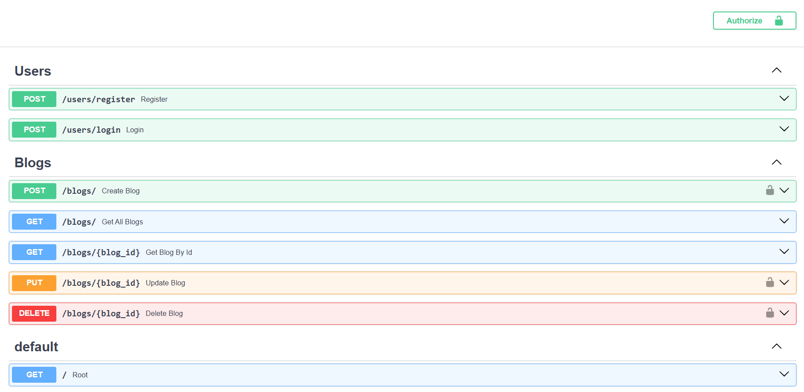

# 📝 Blog API - FastAPI

A production-ready RESTful Blog API built using **FastAPI** that provides secure user authentication, blog management, and authorization using **JWT (JSON Web Tokens)**. The project follows a clean layered architecture with separate routers, services, models, and schemas for maintainability and scalability.

*Live Site* - https://bloghup-api.onrender.com/

*Live Swagger for Testing* - https://bloghup-api.onrender.com/docs

---

## 🚀 Features

### Authentication & Security

- User Registration
- Secure Login using OAuth2 Password Flow
- JWT Authentication
- Password Hashing with bcrypt
- Protected Routes
- Environment Variable Configuration (.env)

### Blog Management

- Create Blog
- Get All Blogs
- Get Blog by ID
- Update Blog (Owner Only)
- Delete Blog (Owner Only)

### API Features

- Pagination
- Request Validation using Pydantic
- SQLAlchemy ORM
- RESTful API Design
- Interactive Swagger UI Documentation

---

## 🛠 Tech Stack

| Category | Technologies     |
|-----------|------------------|
| Backend | FastAPI          |
| Language | Python 3         |
| Database | MySQL            |
| ORM | SQLAlchemy       |
| Authentication | OAuth2 + JWT     |
| Password Hashing | Passlib (bcrypt) |
| Validation | Pydantic         |
| Server | Uvicorn          |
| Environment Variables | python-dotenv    |

---

## 📂 Project Structure

```text
BlogProject_FastAPI/
│
├── auth/
│   ├── hashing.py
│   ├── jwt_handler.py
│   └── oauth2.py
│
├── database/
│   └── database.py
│
├── models/
│   ├── user.py
│   └── blog.py
│
├── routers/
│   ├── user.py
│   └── blog.py
│
├── schemas/
│   ├── user.py
│   └── blog.py
│
├── services/
│   ├── user_service.py
│   └── blog_service.py
│
├── .env.example
├── .gitignore
├── requirements.txt
├── main.py
└── README.md
```

---

## ⚙️ Installation

### 1. Clone the repository

```bash
git clone https://github.com/YOUR_USERNAME/BlogProject_FastAPI.git

cd BlogProject_FastAPI
```

### 2. Create Virtual Environment

Windows

```bash
python -m venv .venv
.venv\Scripts\activate
```

Linux / macOS

```bash
python3 -m venv .venv
source .venv/bin/activate
```

### 3. Install Dependencies

```bash
pip install -r requirements.txt
```

---

## 🔑 Environment Variables

Create a `.env` file in the project root.

Example:

```env
SECRET_KEY=your_secret_key
ALGORITHM=HS256
ACCESS_TOKEN_EXPIRE_MINUTES=30
```

---

## ▶️ Running the Project

Start the development server:

```bash
uvicorn main:app --reload
```

Application will run at:

```
http://127.0.0.1:8000
```

Swagger Documentation:

```
http://127.0.0.1:8000/docs
```

ReDoc Documentation:

```
http://127.0.0.1:8000/redoc
```

---

# 📌 API Endpoints

## Authentication

| Method | Endpoint | Description |
|----------|-----------|-------------|
| POST | `/users/register` | Register a new user |
| POST | `/users/login` | Login and receive JWT token |

---

## Blogs

| Method | Endpoint | Description |
|----------|-----------|-------------|
| GET | `/blogs` | Get all blogs |
| GET | `/blogs/{id}` | Get blog by ID |
| POST | `/blogs` | Create a new blog |
| PUT | `/blogs/{id}` | Update blog (Owner Only) |
| DELETE | `/blogs/{id}` | Delete blog (Owner Only) |

---

## 📖 Authentication Flow

```
User Registration
        │
        ▼
Password gets Hashed
        │
        ▼
User Login
        │
        ▼
JWT Token Generated
        │
        ▼
Client stores JWT
        │
        ▼
Authorization: Bearer <TOKEN>
        │
        ▼
Protected Routes
```

---

## 📑 Pagination

Supports pagination using query parameters.

Example:

```http
GET /blogs?page=1&limit=10
```

Parameters

| Parameter | Description |
|------------|-------------|
| page | Page number |
| limit | Number of blogs per page |

---

## 🔒 Authorization

Only the owner of a blog can:

- Update Blog
- Delete Blog

Unauthorized users receive:

```
403 Forbidden
```

---

## 🧪 Testing

Interactive API testing is available through Swagger UI.

```
https://bloghup-api.onrender.com/docs
```

---

## 🌟 Future Improvements

- Search Blogs
- Sorting
- PostgreSQL Support
- Alembic Database Migrations
- Docker Support
- Unit Testing (Pytest)
- CI/CD Pipeline
- Role-Based Access Control (RBAC)
- Refresh Tokens
- Cloud Deployment

---

## 👨‍💻 Author

**Sumit Sinha**

GitHub: https://github.com/Sumit21Sinha

LinkedIn: https://www.linkedin.com/in/sumit-sinha-454a232a6/
